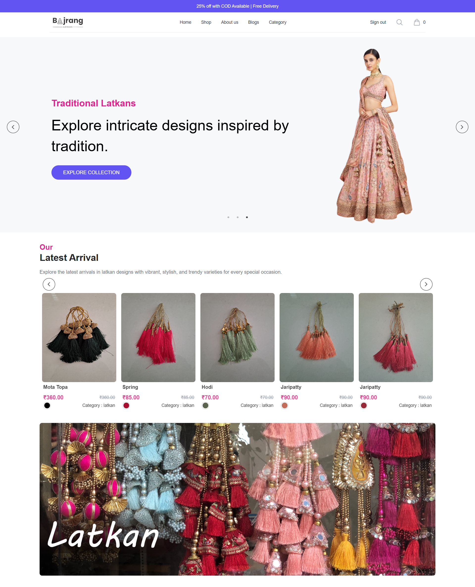
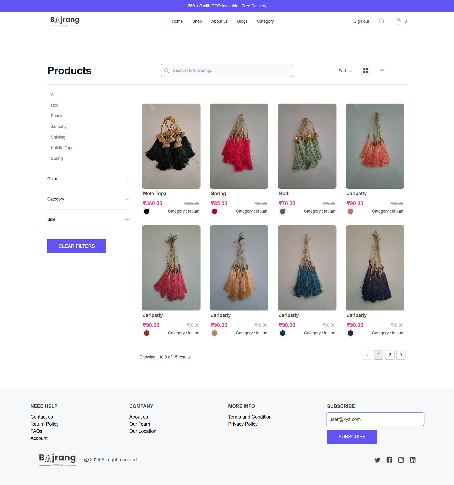
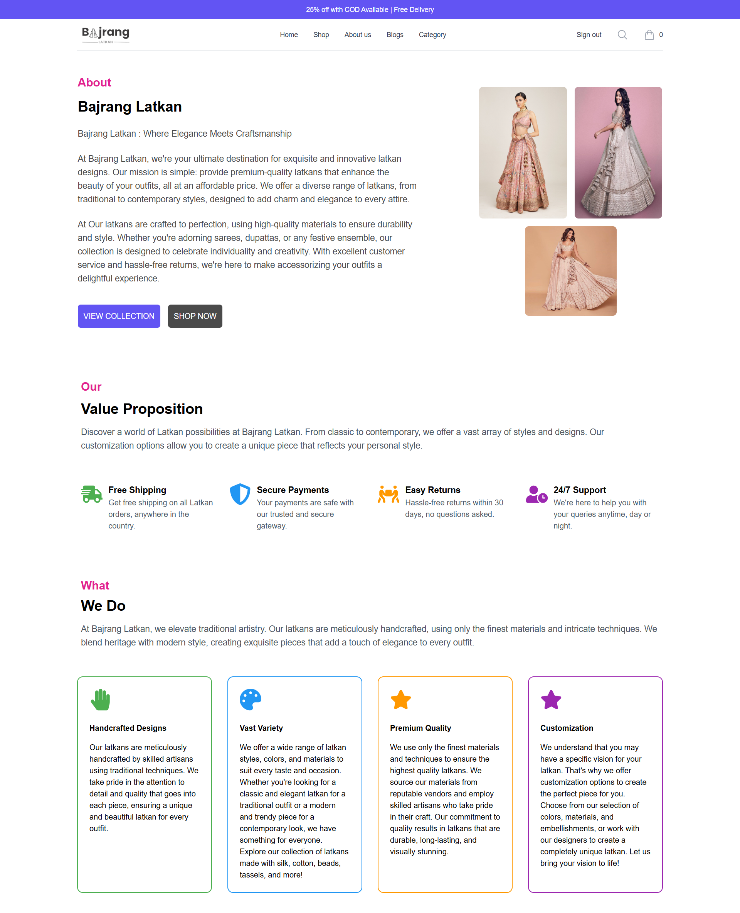

# Bajrang Latkan ✨👗

**Live Link:** [🔗 https://bajrang-2-0.vercel.app/](https://bajrang-2-0.vercel.app/)

---

## Table of Contents 📚
- [About Bajrang Latkan](#about-bajrang-latkan)
- [Features](#features)
- [Technologies and Tools Used](#technologies-and-tools-used)
- [Screenshots](#screenshots)
- [Installation and Setup](#installation-and-setup)
- [Roadmap](#roadmap)
- [Future Enhancements](#future-enhancements)
- [Contributors](#contributors)
- [Contact](#contact)

---

## About Bajrang Latkan 🌟

**Bajrang Latkan: Where Elegance Meets Craftsmanship**

At Bajrang Latkan, we bring you ✨ exquisite and innovative latkan designs that enhance the beauty of your outfits. Our mission is to provide premium-quality latkans at affordable prices. From traditional to contemporary styles, our diverse range of products adds charm and elegance to every attire.

Crafted with precision and high-quality materials, our latkans are designed for durability and style. Whether for sarees, dupattas, or festive ensembles, Bajrang Latkan celebrates individuality and creativity. With excellent customer service and hassle-free returns, accessorizing your outfits becomes a delightful experience.

---

## Features 💎

- **Dynamic Product Listings:** 🛍️ Explore a wide range of latkans with detailed descriptions and high-quality images.
- **User-Friendly Interface:** 🎨 Easy navigation and intuitive design for a seamless shopping experience.
- **Search and Filter Options:** 🔍 Find the perfect latkan by filtering products based on categories, styles, and prices.
- **Secure Checkout:** 🔒 Hassle-free and secure payment options for a reliable shopping experience.
- **Responsive Design:** 📱 Fully optimized for desktops, tablets, and mobile devices.
- **Customer Account Management:** 👤 Users can register, log in, and manage their profiles.
- **Wishlist and Favorites:** 💖 Save your favorite products for future purchases.
- **Hassle-Free Returns:** 🔄 Convenient return policies for a worry-free shopping experience.
- **Admin Dashboard:** 🛠️ Manage products, orders, and customer inquiries efficiently.

---

## Technologies and Tools Used 🛠️

  
  
  


### Frontend:
- **React.js**: ⚛️ For building the dynamic and interactive user interface.

### Backend:
- **Node.js**: 🌐 Server-side JavaScript runtime.
- **Express.js**: 🚀 Web framework for Node.js.

### Database:
- **MongoDB**: 🗄️ NoSQL database for storing product, user, and order information.

### APIs:
- Custom APIs built with Node.js and Express.js for seamless data communication between the frontend and backend.

### Deployment:
- **Vercel**: 🚀 Hosting the frontend for fast and scalable delivery.

---

## Screenshots 📸

  
  


---

## Installation and Setup ⚙️

Follow these steps to run the project locally:

1. Clone the repository:
   ```bash
   git clone <repository-url>
   ```

2. Navigate to the project directory:
   ```bash
   cd bajrang-latkan
   ```

3. Install dependencies for the frontend:
   ```bash
   cd frontend
   npm install
   ```

4. Install dependencies for the backend:
   ```bash
   cd backend
   npm install
   ```

5. Start the development servers:
   - Frontend:
     ```bash
     npm start
     ```
   - Backend:
     ```bash
     npm run dev
     ```

6. Open your browser and visit:
   ```
   http://localhost:5173
   ```

---

## Roadmap 🗺️

- [✔] Dynamic Product Listings
- [✔] Responsive Design
- [ ] Multi-language Support
- [ ] Advanced Analytics
- [ ] Enhanced Payment Gateway

---

## Future Enhancements 🚀

- Add multi-language support to cater to a broader audience. 🌍
- Integrate advanced analytics for better user behavior insights. 📊
- Include more secure payment gateways for international users. 💳
- Expand product categories with user recommendations. 🎯

--


## Contributors 🤝

- **[Mayur Kapadi](https://github.com/mkkapadi12)**: Lead Developer  
- **[Bhargav Maru](https://github.com/bhargavmaru07)**: Developer  

---

## Contact 📞

For any queries or support, feel free to reach out:

- **Email:** 📧 mayurkapadi12@gmail.com
- **Phone:** 📞 +91 9727434078

---

Thank you for visiting Bajrang Latkan! 🌸 We hope you enjoy your shopping experience. 🛍️
